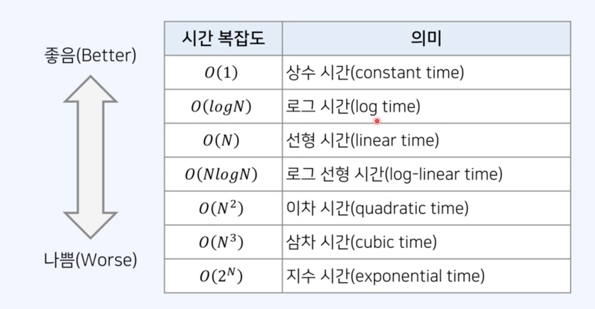

## 시간 복잡도

시간 복잡도는 알고리즘의 성능을 나타내는 척도이다.

- 특정한 크기의 입력에 대하여 알고리즘의 수행 시간 분석
- 동일한 기능을 수행하는 알고리즘이 있다면, 일반적으로 복잡도가 낮을수록 우수하다.

## 빅오 표기법 (Big-O Notation)

- 가장 빠르게 증가하는 항만을 고려하는 표기법
- 함수의 상한을 나타낸다.



### 예시

- 상수 시간: 사칙연산
- 로그 시간: 이분탐색
- 선형 시간: 배열을 일일이 확인할때
- 로그 선형 시간: 퀵 정렬, 병합 정렬...
- 이차 시간: 동적 계획법..
- 삼차 시간: ?

## 자바스크립트로 파일 읽어오기

- 입력 데이터가 텍스트 파일 형태로 주어지는 경우, 파일 시스템 모듈을 사용한다.
- 예를 들어 /dev/stdin 파일에 적힌 텍스트를 읽어오는 경우, 다음과 같이 코드를 작성한다.
- 기능: 전체 텍스트를 읽어 온 뒤에, 줄바꿈 기호를 기준으로 구분하여 리스트로 변환하기

```js
const fs = require('fs');
const filePath = process.platform === 'linux' ? '/dev/stdin' : './input.txt';
let input = fs.readFileSync(filePath).toString().split('\n');

input = input[0];
input = input.split(' ').map((item) => item);

solution();

function solution() {
  // Write your code
}
```

## readline 모듈

한 줄씩 입력을 받아서, 처리하여 정답을 출력할 때는 readline 모듈을 사용할 수 있다.

```js
const rl = require('readline').createInterface({
  input: process.stdin,
  output: process.stdout,
});

let input = [];
rl.on('line', function (line) {
  // 콘솔 입력 창에서 줄바꿈을 입력할 떄마다 호출
  input.push(line);
}).on('close', function () {
  // 콘솔 입력 창에서 ctrl + C 혹은 ctrl + D를 입력하면 호출 (입력의 종료)
  console.log(input);
  process.exit();
});
```

## 선형 구조

- 선형구조
  - 배열 (array)
  - 연결 리스트 (linked list)
  - 스택 (stack)
  - 큐 (queue)
- 비선형 구조
  - 트리 (tree)
  - 그래프 (graph)

## 프로그램의 성능 측정 방법

- 일반적으로 연산 횟수가 10억을 넘어가면 1초 이상의 시간이 소요된다.
  [예시] 𝑛이 1,000일 때를 고려해 보자.
  - 𝑂 𝑛 : 약 1,000번의 연산
  - 𝑂 𝑛𝑙𝑜𝑔𝑛 : 약 10,000번의 연산
  - 𝑂 𝑛2 : 약 1,000,000번의 연산
  - 𝑂 𝑛3 : 약 1,000,000,000번의 연산
